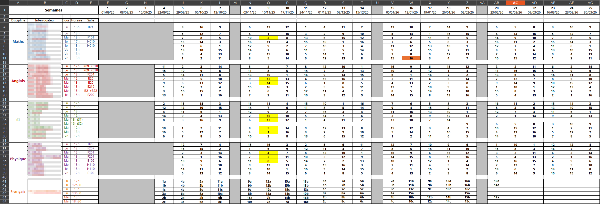
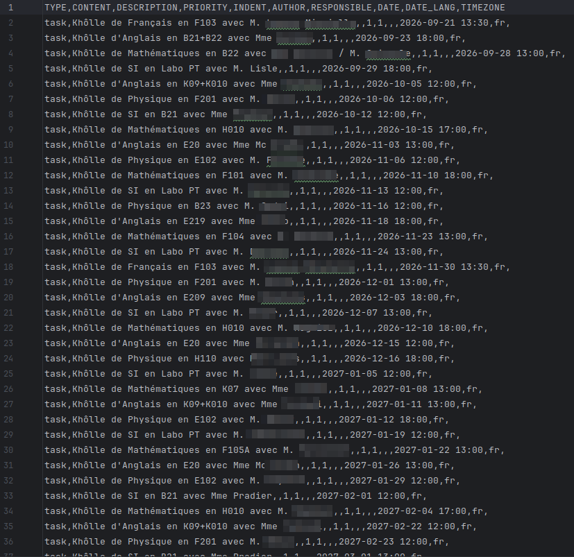
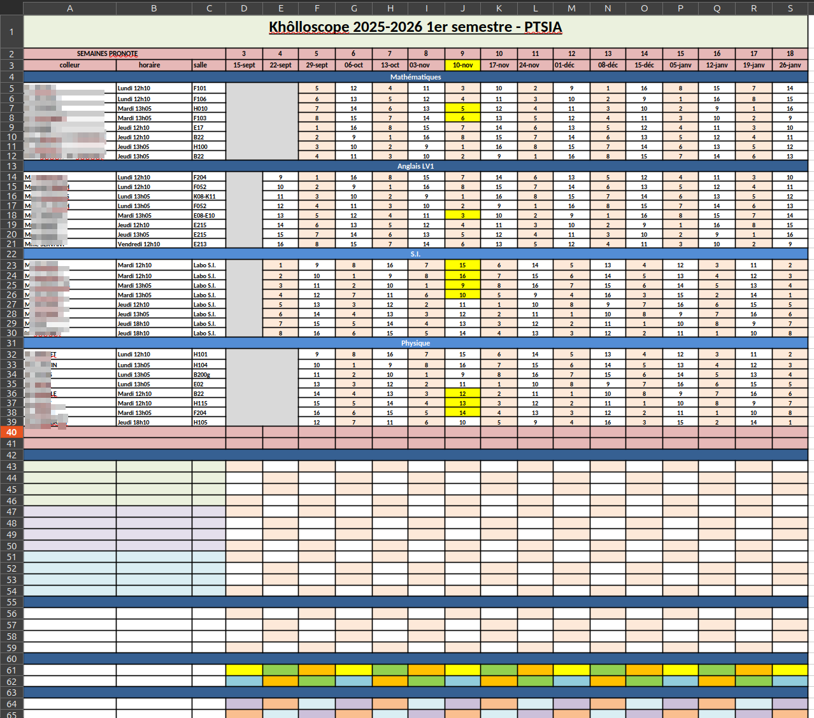
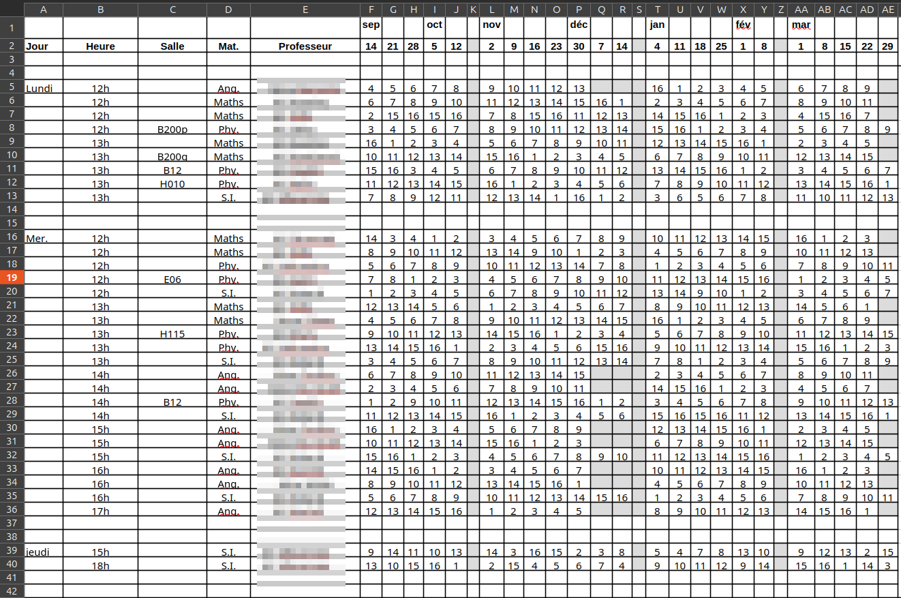
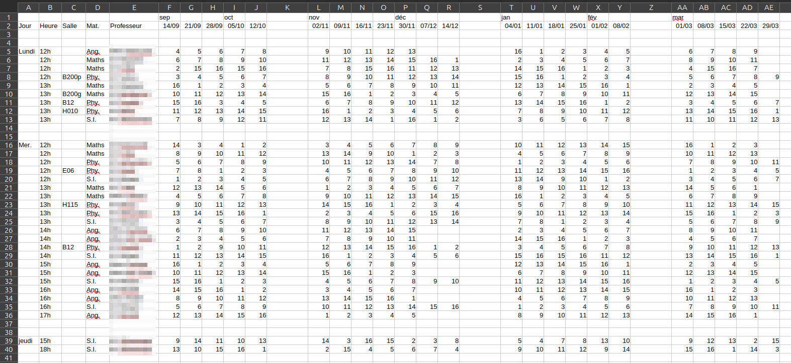

# universal_kholloscopeur
Un projet de conversion intelligente de csv sous un format importable sur todoist à partir d'un calendrier

# Utilisation des fichiers issus du programme 

Si vous possédez un fichier généré par le programme, cf [ce lien](import_todoist.md)


# Ce que fait le programme

Il permet de convertir un tableau excel respectant contenant toutes les kholles d'une classe (respectant certaines condition, cf  [section plus bas](#conditions-sur-le-fichier-excel)), comme le suivant :


En autant de fichiers CSV que de groupes de kholles différents (un par personne si certaines kholles sont individuelles, un par groupe si toutes les kholles sont collectives).

Ce fichier en lui-même est déjà plus lisible que le kholloscope traditionnel :



Mais il peut surtout être importé dans Todoist (mobile et PC), afin de voir en un coup d'oeil toutes les informations des khôlles, recevoir des notifications, etc :


# Pour l'exécution 

La première chose à faire est de s'assurer que le fichier excel (ou le pdf qui sera converti en tableau excel) respecte les conditions décrites dans la section ci-dessous. <br>

## 1) Conditions sur le fichier excel :

Si le kholloscope est de la forme suivante (informations en trop, ici des TD/TP), il faut les supprimer avant export en CSV :

<p>
  
  
</p>

- Toutes les catégories doivent être à minima séparées par un espace. Par exemple, dans une cellule :
  - Lundi 12h00 : OK
  - Lundi-12h00 : NON (sera considéré comme un mot, échouera les tests de catégories)
- Les salles sont inscrites dans une cellule à part (une cellule contenant "lundi d300" aura pour valeur de salle "lundi d300")
- Idem pour le professeur
- Les semaines du kholloscope doivent contenir dans la même case une information au moins sur le jour mais aussi sur le mois (e.g. "02/01" ou même "2-sept") mais surtout pas comme dans l'exemple suivant :


Ici les semaines ne peuvent être distinguées des élèves dans un format CSV, on peut alors rajouter le mois manuellement :


Et ici le code fonctionnera parfaitement.

## Exemples de tableurs fonctionnels (se rapprocher de leurs formats peut résoudre des problèmes)


## 2) Convertir le tableau en CSV

Cela se fait simplement depuis le tableur ("enregistrer sous" ou "exporter", choisir le format CSV)


## 3) S'approprier le code

1. Il faut disposer de python 3.8 ou plus
2. Il faut avoir un IDE (ex : PyCharm, Visual Studio Code, etc.)
3. Récupérez le dossier (bouton vert "Code" sur GitHub → "Download ZIP", ou `git clone` si vous utilisez git).
4. Ouvrez le dossier dans PyCharm ou VS Code.
5. L'IDE va détecter le fichier `requirements.txt` et proposer d'installer les dépendances (pandas, openpyxl, dateparser) — cliquez sur "Install"/"Yes" quand ça apparaît.
    Si l'IDE ne propose rien automatiquement : ouvrez le terminal intégré de l'IDE (en bas de la fenêtre, onglet "Terminal") — pas besoin d'en ouvrir un autre — puis :
```bash
pip install -r requirements.txt
```
6. Renseignez le chemin du kholloscope dans `config.py` (ou `config.exemple.py` si le programme n'a pas encore créé `config.py`) et vérifiez que toutes les variables du fichier comportent les notations propres à votre kholloscope.
7. Lancez `main.py`.

# Contact


Si vous avez la moindre suggestion, le moindre bug, la moindre interrogation essayez d'ouvrir un ticket sur github ou de me contacter par mail :
universalkholloscopeur.support@gmail.com
