# Résultat de l'import

Une liste des kholles accessible sur Todoist (mobile, pc, navigateur), notification au moment de la kholle, etc :  

# Étapes de l'import 

## 1. Avoir son fichier csv 

Il vous a soit été donné directement par quelqu'un, soit est issu du programme.
## 2. Importer le fichier csv dans Todoist
2 moyens :
1. [Sur mobile](#sur-mobile)
2. [Sur ordinateur](#sur-ordinateur-plus-simple) 

### Sur ordinateur (plus simple)

1. Se rendre soit sur le site web (https://todoist.com/) soit sur l'application. 
2. Se connecter / s'inscrire
3. Dans le menu de gauche, cliquer sur le plus pour créer un projet.
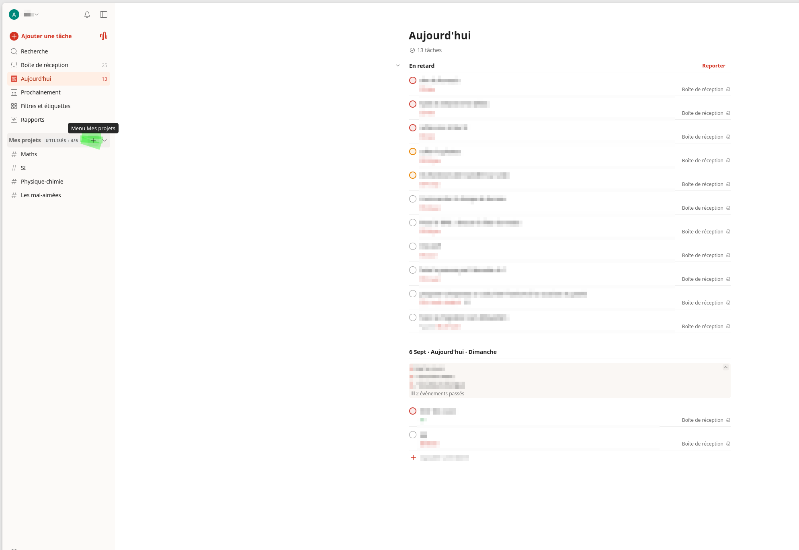
4. Donner un nom, puis cliquer sur ajouter.
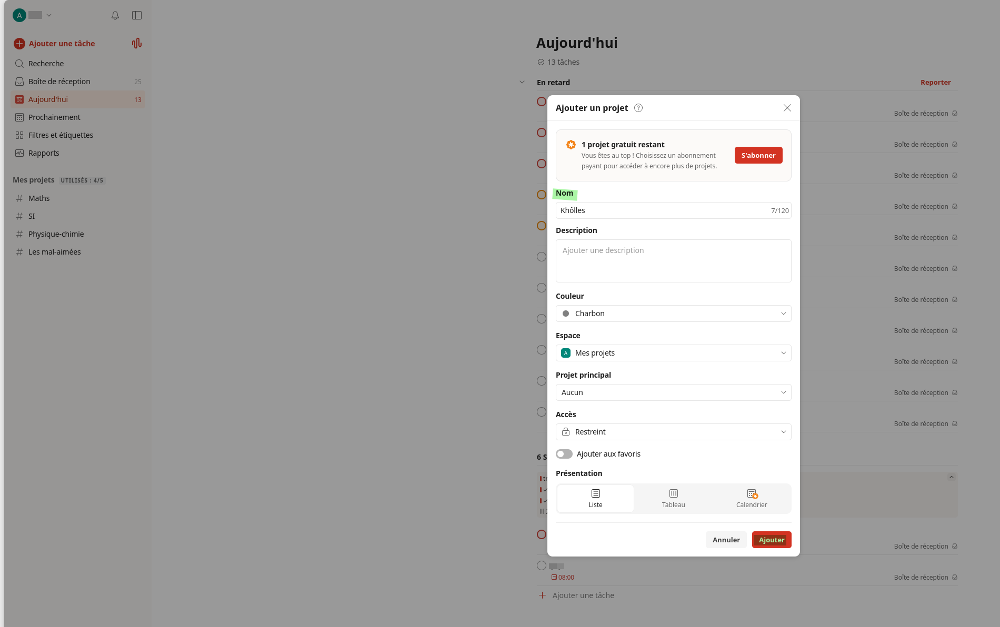
5. Une fois le projet créé, cliquer sur le bouton "importer des tâches depuis un fichier CSV" en bas de la page.  
   (Si le bouton n'est pas présent, il faut cliquer sur les trois points en haut à droite de la page du projet pour ouvrir le menu avant de cliquer sur "importer des tâches depuis un fichier CSV")
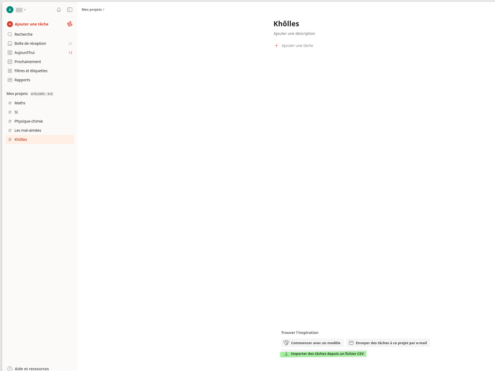
6. Choisir "télécharger depuis votre ordinateur", et donner le fichier qui vous a été fourni.
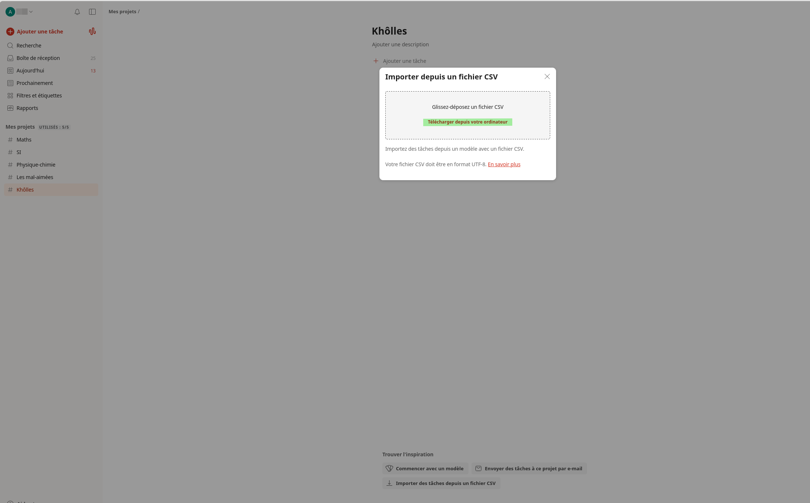
7. Après un (relativement) court chargement, vous obtenez :
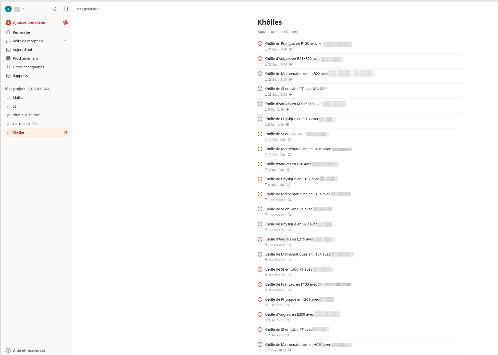

### Sur mobile

1. Il faut passer par le site web (en navigation privée pour éviter la redirection sur l'application, https://todoist.com/auth/login).
2. Se connecter / s'inscrire
3. Une fois sur la page de l'application, cliquer sur le bouton en haut à gauche pour ouvrir le menu.  
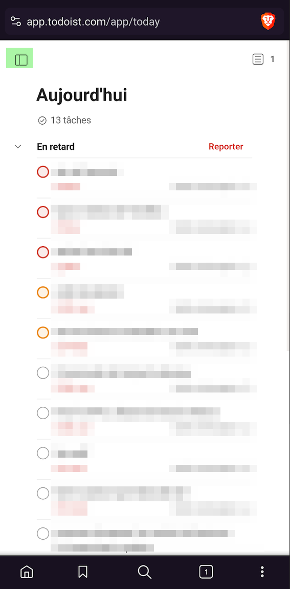

4. Cliquer sur "Mes projets".  
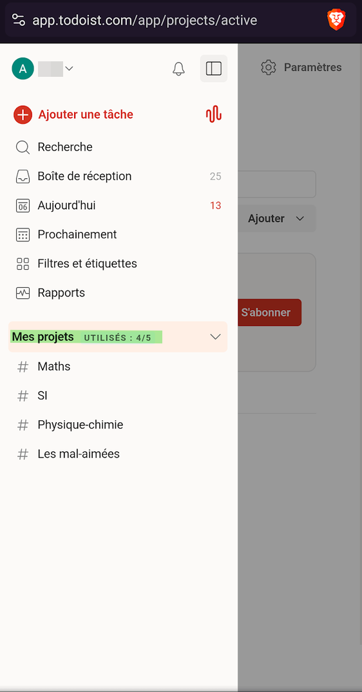

5. Ajouter un projet.  
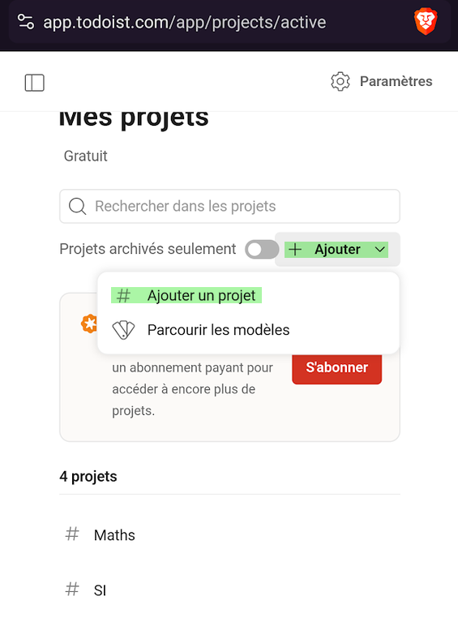
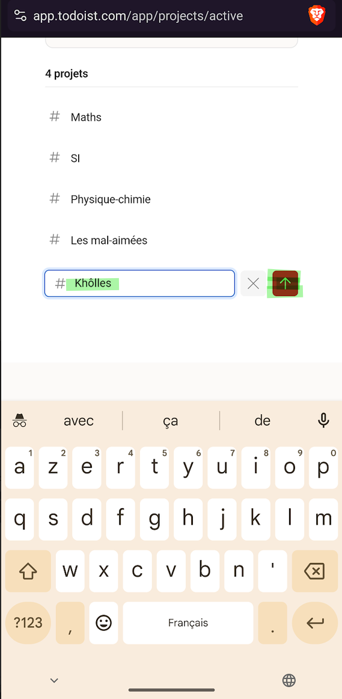

6. Une fois dans la page du projet, cliquer soit sur "importer des tâches depuis un fichier CSV" en bas de la page, soit sur les trois points en haut à droite (puis "importer des tâches depuis un fichier CSV").  
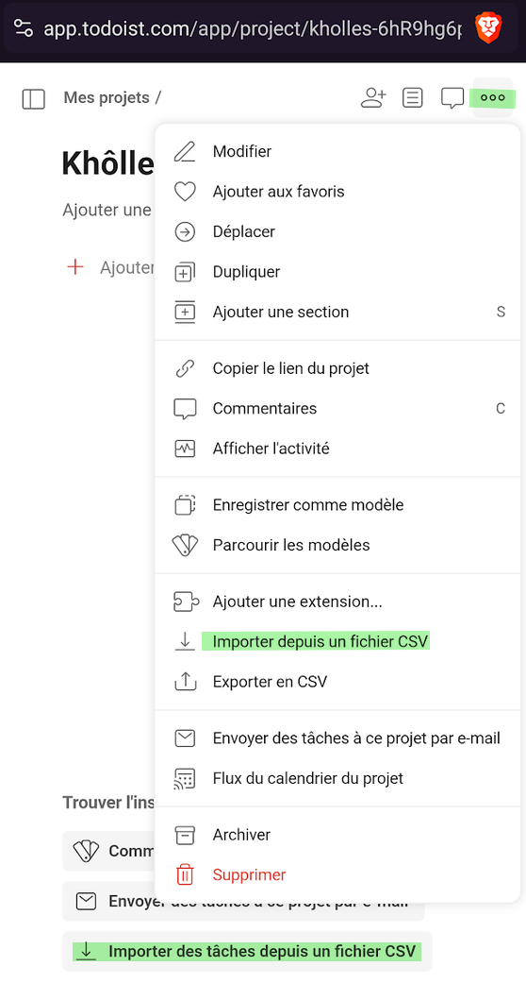

7. Cliquer sur "Télecharger depuis votre ordinateur", puis sélectionner votre fichier.  
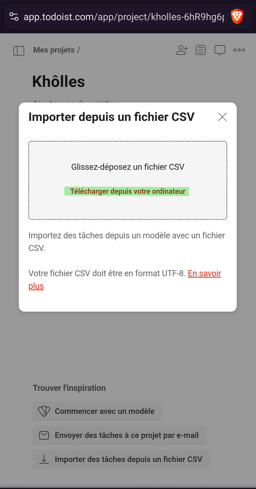

8. Après un (relativement) court chargement, vous obtenez :  

# Contact

Si vous avez la moindre suggestion, le moindre bug, la moindre interrogation essayez d'ouvrir un ticket sur github ou de me contacter par mail :
universalkholloscopeur.support@gmail.com
